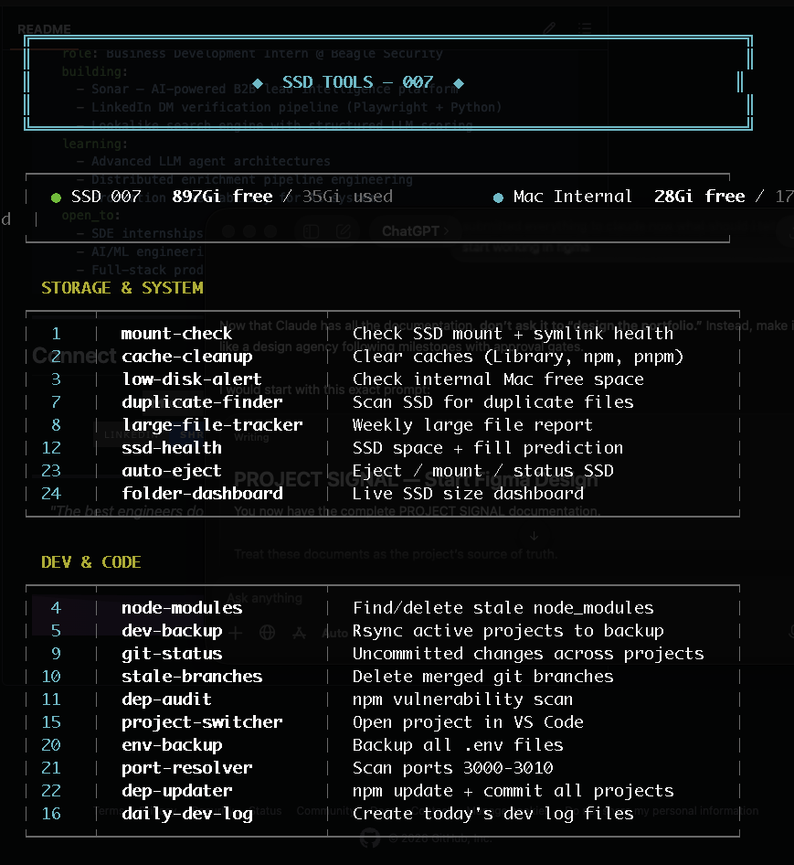
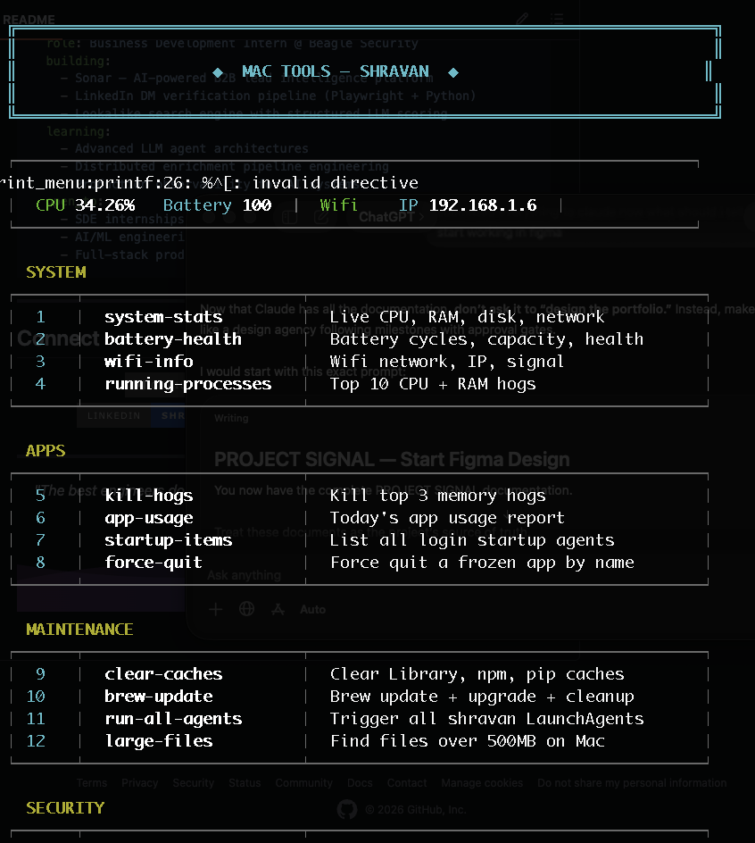

# mac-ssd-toolkit

Use an external SSD as your Mac's primary storage — with automation, monitoring, and a terminal menu system.


> If this helped you, consider giving it a ⭐ — it helps others find it.

## Preview




```
  ╔═══════════════════════════════════════════════════════════════════════╗
  ║                                                                       ║
  ║                      ◈  SSD TOOLS — 007  ◈                           ║
  ║                                                                       ║
  ╚═══════════════════════════════════════════════════════════════════════╝

  ┌─────────────────────────────────────────────────────────────────────┐
  │  ● SSD 007   899G free / 33G used          ● Mac Internal  40G free │
  └─────────────────────────────────────────────────────────────────────┘

  STORAGE & SYSTEM
  ┌──────┬──────────────────────┬────────────────────────────────────────┐
  │  1   │  mount-check         │  Check SSD mount + symlink health      │
  │  2   │  cache-cleanup       │  Clear caches (Library, npm, pnpm)     │
  │  3   │  low-disk-alert      │  Check internal Mac free space         │
  │  7   │  duplicate-finder    │  Scan SSD for duplicate files          │
  │ 12   │  ssd-health          │  SSD space + fill prediction           │
  │ 23   │  auto-eject          │  Eject / mount / status SSD            │
  └──────┴──────────────────────┴────────────────────────────────────────┘

  DEV & CODE
  ┌──────┬──────────────────────┬────────────────────────────────────────┐
  │  4   │  node-modules        │  Find/delete stale node_modules        │
  │  5   │  dev-backup          │  Rsync active projects to backup       │
  │  9   │  git-status          │  Uncommitted changes across projects   │
  │ 10   │  stale-branches      │  Delete merged git branches            │
  │ 20   │  env-backup          │  Backup all .env files                 │
  └──────┴──────────────────────┴────────────────────────────────────────┘

  Enter number or name  •  q to quit
  ❯
```

```
  ╔═══════════════════════════════════════════════════════════════════════╗
  ║                                                                       ║
  ║                    ◈  MAC TOOLS — SHRAVAN  ◈                         ║
  ║                                                                       ║
  ╚═══════════════════════════════════════════════════════════════════════╝

  ┌─────────────────────────────────────────────────────────────────────┐
  │  CPU 12%   Battery 100% (charged)   Uptime 2 days                   │
  │  Wifi MyNetwork   IP 192.168.1.6                                     │
  └─────────────────────────────────────────────────────────────────────┘

  SYSTEM
  ┌──────┬──────────────────────┬────────────────────────────────────────┐
  │  1   │  system-stats        │  Live CPU, RAM, disk, network          │
  │  2   │  battery-health      │  Battery cycles, capacity, health      │
  │  3   │  wifi-info           │  Wifi network, IP, signal              │
  │  4   │  running-processes   │  Top 10 CPU + RAM hogs                 │
  └──────┴──────────────────────┴────────────────────────────────────────┘

  SECURITY
  ┌──────┬──────────────────────┬────────────────────────────────────────┐
  │ 13   │  firewall-status     │  Check firewall + stealth mode         │
  │ 14   │  open-ports          │  Scan all listening ports              │
  │ 15   │  lock-screen         │  Lock Mac screen immediately           │
  │ 16   │  ssh-keys            │  List SSH keys + fingerprints          │
  └──────┴──────────────────────┴────────────────────────────────────────┘

  Enter number or name  •  q to quit
  ❯
```

Built for Macs with limited internal storage (128–256GB). Moves your dev projects, toolchains, and user folders to SSD transparently via symlinks, then automates backup, cleanup, and system health.

---

## Table of Contents

- [How it works](#how-it-works)
- [Results](#results)
- [What's included](#whats-included)
- [Install](#install)
- [Before You Start](#before-you-start--important-setup-notes)
- [Troubleshooting](#troubleshooting)
- [Contributing](#contributing)

---

## How it works

macOS follows symlinks transparently — apps and tools have no idea they're reading from an external drive.

```bash
# Move Downloads to SSD
mv ~/Downloads /Volumes/007/Downloads
ln -s /Volumes/007/Downloads ~/Downloads

# Everything that writes to ~/Downloads now writes to the SSD
# No config changes needed in any app
```

Do this for Downloads, Documents, Desktop, Movies, all dev projects, and toolchains (`.nvm`, `.rustup`, `.cargo`, `.npm`, etc.) — and your internal drive clears up fast.

---

## Results

| Before | After |
|--------|-------|
| 23GB free on internal | 36GB free (13GB+ recovered) |
| Manual backups (or none) | Nightly automated rsync |
| No disk monitoring | Hourly low-disk alerts |
| Scattered dotfiles | Nightly versioned backup |
| No SSD security | Serial number lock |

---

## What's included

### `ssd` — SSD Tools Menu (27 scripts)
| Category | Scripts |
|----------|---------|
| Storage | Mount check, cache cleanup, disk alert, duplicate finder, large file tracker, SSD health, auto-eject, folder dashboard |
| Dev | Node modules cleaner, dev backup, git status report, stale branch cleaner, dep audit, project switcher, env backup, port resolver, dep updater, daily dev log |
| System | Startup optimizer, app usage, RAM monitor, battery logger, serial lock |
| Productivity | Screenshot organizer, focus mode, meeting prep, dotfiles backup |

### `mac` — Mac Tools Menu (19 tools)
| Category | Tools |
|----------|-------|
| System | Live stats, battery health, wifi info, top processes |
| Apps | Kill hogs, app usage, startup items, force quit |
| Maintenance | Clear caches, brew update, run all agents, find large files |
| Security | Firewall status, open ports, lock screen, SSH keys |
| Power | Caffeinate, sleep timer, battery saver |

### LaunchAgents (18 automated tasks)
Nightly backups, cache cleanup, disk alerts, git status reports, dependency audits, battery logging — all scheduled via macOS launchd.

---

## Install

```bash
git clone https://github.com/sxrxvxnn/mac-ssd-toolkit
cd mac-ssd-toolkit
chmod +x install.sh
./install.sh
```

The installer will ask for:
- Your Mac username
- Your SSD volume name (e.g. `007`, `MySSD`)
- Your dev project names

Then run:
```bash
source ~/.zshrc
```

Type `ssd` or `mac` to launch.

---

## Requirements

- macOS 12+
- Homebrew (`/bin/bash -c "$(curl -fsSL https://raw.githubusercontent.com/Homebrew/install/HEAD/install.sh)"`)
- An external SSD **formatted as APFS** (not HFS+, not ExFAT)

---

## Before You Start — Important Setup Notes

Lessons learned from real-world setup. Read these before running the installer.

### 1. Format your SSD as APFS (not HFS+)

HFS+ can develop filesystem corruption under heavy use with symlinks + Time Machine + active writes simultaneously. APFS is more resilient and is what macOS is optimized for.

**How to format:**
1. Open Disk Utility
2. Select your SSD → click **Erase**
3. Format: **APFS**, Scheme: **GUID Partition Map**
4. Name it (e.g. `007`)

> If your SSD came pre-formatted as HFS+ and you've already set up symlinks — reformat now before continuing. Back up first.

### 2. Disable WD Disk Locker before setup (WD drives only)

If you have a WD drive with hardware lock enabled, it will prevent writes even after granting Full Disk Access. Disable it first:
- Open **WD Discovery** → unlock the drive
- Or reformat the drive (this removes the lock)

### 3. Grant Full Disk Access to Terminal + Chrome

**System Settings → Privacy & Security → Full Disk Access:**
- Add **Terminal** (required for scripts to work)
- Add **Google Chrome** (required for downloads to SSD)

**System Settings → Privacy & Security → Files and Folders:**
- Google Chrome → enable **Downloads Folder** + external drives

### 4. Set Chrome download path to real SSD path (not symlink)

Chrome's sandbox doesn't follow symlinks reliably. Set the download location to the actual SSD path:

**Chrome → Settings → Downloads → Change → press Cmd+Shift+G → paste:**
```
/Volumes/YOUR_SSD_NAME/Downloads
```

### 5. Time Machine: use weekly backups, not hourly

If you set Time Machine to hourly on the same SSD you're using as primary storage, it creates heavy I/O that can cause filesystem issues. Weekly is safer and still gives you solid recovery points.

### 6. Screenshot save path

macOS screenshot tools (Cmd+Shift+5) don't reliably follow symlinks for save location. Set it explicitly:
```bash
defaults write com.apple.screencapture location /Volumes/YOUR_SSD_NAME/Desktop
killall SystemUIServer
```

---

---

## Direct commands

```bash
ssd 5          # Run dev backup
ssd git-status # Run by name
mac 2          # Battery health
mac open-ports # Run by name
```

---

## Aliases installed

```bash
ssd        # SSD tools menu
mac        # Mac tools menu
dev        # cd to SSD Dev folder
gs         # git status
ga         # git add -A
gc         # git commit -m
gp         # git push
gl         # git log --oneline -10
freeup     # Clear caches
backup     # Run dev backup
focus      # Start focus mode (25min)
reload     # Reload .zshrc
```

---

## Uninstall

```bash
./uninstall.sh
```

---

## Troubleshooting

**Chrome shows "Something went wrong" when downloading**
- Grant Chrome Full Disk Access in System Settings → Privacy & Security
- Set Chrome download path to the real SSD path (not `~/Downloads` symlink): `/Volumes/YOUR_SSD/Downloads`

**SSD writes failing / "Invalid argument" error**
- Your SSD filesystem has errors. Run Disk Utility → First Aid on the drive
- If First Aid fails, back up data and reformat as APFS

**First Aid fails with "Unable to unmount volume" (-69673)**
- The drive is in use. Quit all apps, close all terminals, then retry
- If still failing, boot into Recovery Mode (hold Power on Apple Silicon) → Disk Utility → First Aid

**"File system check exit code is 8" / First Aid fails completely**
- Filesystem is corrupted beyond macOS repair
- Back up all data: `rsync -av /Volumes/007/ ~/SSD-backup/`
- Erase and reformat as APFS in Disk Utility
- Restore data back

**LaunchAgents failing (exit code 127)**
- Scripts run before SSD mounts at boot — this is handled automatically by the installer with a wait loop
- If still failing: `launchctl unload ~/Library/LaunchAgents/com.USERNAME.AGENT.plist && launchctl load ~/Library/LaunchAgents/com.USERNAME.AGENT.plist`

**Screenshots not saving to SSD Desktop**
- Run: `defaults write com.apple.screencapture location /Volumes/YOUR_SSD/Desktop && killall SystemUIServer`

**QuickTime screen recording won't save**
- System Settings → Privacy & Security → Screen Recording → add QuickTime Player
- Use Cmd+Shift+5 (built-in) as alternative

**SSD not mounting on boot**
- Normal for external drives — scripts use a wait loop to handle this
- Check: `ssd 1` (mount-check) after plugging in

---

## Contributing

See [CONTRIBUTING.md](CONTRIBUTING.md) — contributions welcome. New scripts, bug fixes, new mac tool ideas, platform improvements.

---

## License

MIT
